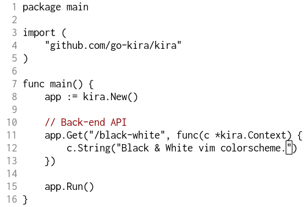

  <h1 align="center">Black & White</h1>
  
Minimal vim colorscheme.

  <a href="#installation">Installation</a> |
  <a href="#screenshots">Screenshots</a>

---

## Installation

- **Vim-Plug**: `Plug 'lafriakh/black-white.vim'`

## Screenshots

TODO
